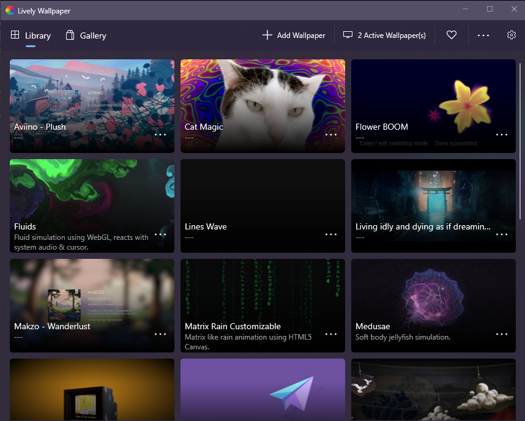
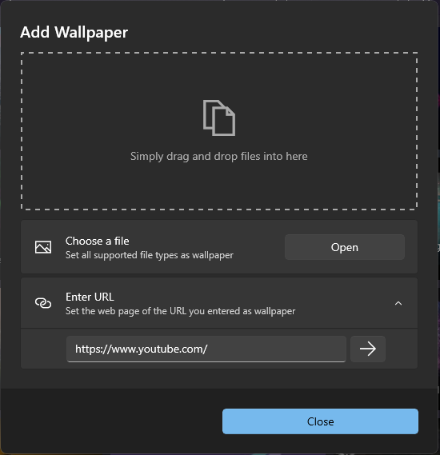
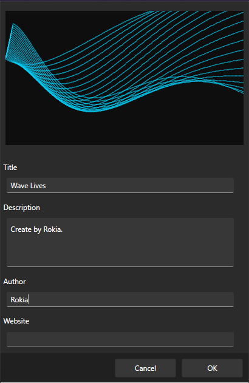
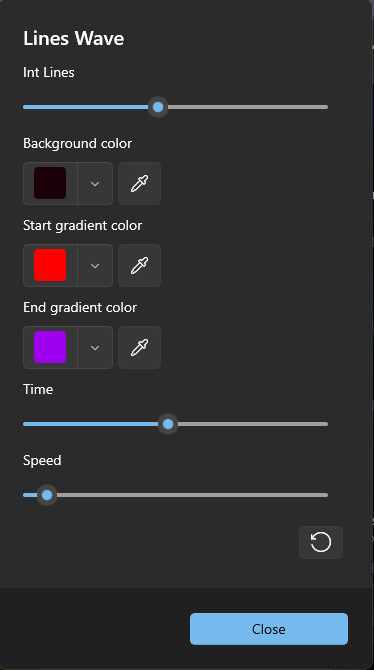

# User wall page in Windows OS
## Install:
  - Install app [Lively Wallpaper](https://apps.microsoft.com/store/detail/lively-wallpaper/9NTM2QC6QWS7) or build in [Github - Dani John  - rocksdanister - lively](https://github.com/rocksdanister/lively).
  - Open app installed like this: 
  - CLick **Add Wallpaper** here .
  - Click **Open** in Choose a file: 
  - Choose file index.html to add.
  - Next Enter the name of the image you want to save 
  - Click OK and **It DONE!**
## Customise:
  - In new Add Wave Lines click icon 
  - Choose **Customise** 
  - This is the interface Customise:
    - 
## Preview:
  - 
